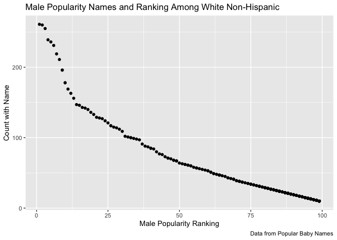

p8105\_hw2\_ac4140
================
Arielle
9/30/2019

Question 1
----------

#### First,read and cleaned the Mr. Trash Wheel Dataset

``` r
health_harbor =
  readxl::read_excel("./data/Trash-Wheel-Collection-Totals-8-6-19.xlsx", 
   sheet = "Mr. Trash Wheel") %>% 
  janitor::clean_names () %>% 
  select(-x15, -x16, -x17) %>% 
  drop_na(dumpster) %>%
  mutate(
    sports_balls = 
      as.integer (round(sports_balls, digit = 0))
  )
```

    ## New names:
    ## * `` -> ...15
    ## * `` -> ...16
    ## * `` -> ...17

#### Reading in Precipitation 2017 Dataset

``` r
prcp_2017 =
  readxl::read_excel("./data/Trash-Wheel-Collection-Totals-8-6-19.xlsx", 
   sheet = "2017 Precipitation",
   range = "A2:B14") %>% 
  janitor::clean_names () %>% 
  drop_na(total)%>%
  mutate(
    year = 2017
  )
```

#### Reading in Precipitation 2018 Dataset

``` r
prcp_2018 =
  readxl::read_excel("./data/Trash-Wheel-Collection-Totals-8-6-19.xlsx", 
   sheet = "2018 Precipitation",
   range = "A2:B14" ) %>% 
  janitor::clean_names () %>% 
  drop_na(total)%>%
  mutate(
    year = 2018
  )
```

#### Now I will combine the two Preciptation Data files into one

``` r
prcp_full= 
  full_join(prcp_2017,prcp_2018) %>% 
  janitor:: clean_names() %>% 
  mutate(
    month = month.name[month]
  )
```

    ## Joining, by = c("month", "total", "year")

The number observations in the health\_harbor dataset is 344and the number of observations in prcp\_2017 was 12 and the number of observations in prcp\_2018 was 12. The joined data set had 24 number of observations. Some key variables in the dataset included month total and years. The total precipitation in 2018 was 70.33The median number of sports balls in dumpster in 2017 was 8.

Question 2
----------

#### Reading in Fiver Thirty Eight Data Sets

##### 

    * Setting up the Pols-Month file

``` r
pols_month_df = 
  read_csv(file= "./data/fivethirtyeight_datasets/pols-month.csv") %>% 
  janitor:: clean_names () %>% 
  separate (mon, into = c("year", "month","day"), convert = TRUE) %>% 
  mutate(
    year= as.integer(year),
    month = as.integer(month),
    day = as.integer(day)
  ) %>% 
  mutate(month = month.name[month]) %>% 
  mutate(prez_dem = recode(prez_dem, "1"= "dem")) %>% 
  mutate(prez_gop = recode(prez_gop, "1"= "gop")) %>% 
  pivot_longer(c("prez_dem", "prez_gop"),
                  values_to = "president",
                  values_drop_na = TRUE) %>% 
    select(-day)
```

    ## Parsed with column specification:
    ## cols(
    ##   mon = col_date(format = ""),
    ##   prez_gop = col_double(),
    ##   gov_gop = col_double(),
    ##   sen_gop = col_double(),
    ##   rep_gop = col_double(),
    ##   prez_dem = col_double(),
    ##   gov_dem = col_double(),
    ##   sen_dem = col_double(),
    ##   rep_dem = col_double()
    ## )

    ## Warning: Unreplaced values treated as NA as .x is not compatible. Please
    ## specify replacements exhaustively or supply .default

    ## Warning: Unreplaced values treated as NA as .x is not compatible. Please
    ## specify replacements exhaustively or supply .default

#### Reading in Fiver Thirty Eight Data Sets

##### 

    * Setting up the SNP File

``` r
SNP_df = 
  read_csv(file="./data/fivethirtyeight_datasets/snp.csv")%>%  
  janitor:: clean_names () %>% 
   separate (date, into = c("month","day","year"), convert = TRUE) %>% 
   select (year, month, close, -day) %>% 
  mutate(month = month.name[month])
```

    ## Parsed with column specification:
    ## cols(
    ##   date = col_character(),
    ##   close = col_double()
    ## )

#### Reading in Fiver Thirty Eight Data Sets

##### 

    * Setting up the unemployment File

``` r
umemployment_df = 
  read_csv(file="./data/fivethirtyeight_datasets/unemployment.csv")%>%  
    pivot_longer (
    Jan : Dec,
    names_to = "month",
    values_to = "rate") %>%
    mutate(month=match(month , month.abb)) %>% 
    mutate(month = month.name[month]) %>% 
    mutate (Year = as.integer(Year)) %>% 
    janitor::clean_names()
```

    ## Parsed with column specification:
    ## cols(
    ##   Year = col_double(),
    ##   Jan = col_double(),
    ##   Feb = col_double(),
    ##   Mar = col_double(),
    ##   Apr = col_double(),
    ##   May = col_double(),
    ##   Jun = col_double(),
    ##   Jul = col_double(),
    ##   Aug = col_double(),
    ##   Sep = col_double(),
    ##   Oct = col_double(),
    ##   Nov = col_double(),
    ##   Dec = col_double()
    ## )

#### Reading in Fiver Thirty Eight Data Sets

##### 

    * Creating a new dataset that merges the three data set

``` r
full_data = pols_month_df %>% 
  left_join (SNP_df,
             by = c("year","month")) %>% 
  left_join (
    umemployment_df,
    by = c("year","month")
  )
```

The polls dataset contains info from 1947 through 2015 showing who was in office for each year and whether or it was republcian or democratic. The new variable that was made was the the president of that year and whether or not he was in the republican party or the democratic party.We also looked at the who was in office for senate, house and president.The second dataset that was enterd was SNP- s and p stock index and that the month, year and the stock index that is associated with each dates. This data set had 787 oberservation with 3 variables, the year of range 1950 to 2015. The third dataset umemployment showed the month and year and the employment rates of those years. This data set had 816 observation with three variables, the range for this data was 1947 to 2015. to In the final dataset we merge the three dataset together and came up with a final dataset that included all three dataset this data ranged from 1947 and 2015.It has 817 observations and 12 variables.They key varianbles are month and year and this is what we used to join the data sets together.

Problem 3
---------

#### Reading and cleaning the dataset for Popularity of Baby Names

##### \* removed all the data with duplicated inforamtion as well as made sure that all the names appeared the same way in the dataset.

``` r
baby_names = 
  read_csv(file="./data/Popular_Baby_Names.csv")%>%
  janitor:: clean_names () %>% 
  mutate(
   childs_first_name = str_to_title (childs_first_name)
  ) %>% 
   mutate(ethnicity = recode(ethnicity, "ASIAN AND PACI"= "ASIAN AND PACIFIC ISLANDER")) %>% 
    mutate(ethnicity = recode(ethnicity, "BLACK NON HISP"= "BLACK NON HISPANIC")) %>% 
  mutate(ethnicity = recode(ethnicity, "WHITE NON HISP"= "WHITE NON HISPANIC")) %>% 
  distinct ()
```

    ## Parsed with column specification:
    ## cols(
    ##   `Year of Birth` = col_double(),
    ##   Gender = col_character(),
    ##   Ethnicity = col_character(),
    ##   `Child's First Name` = col_character(),
    ##   Count = col_double(),
    ##   Rank = col_double()
    ## )

#### Created a table with the rank and popularity for Olivia

##### \* Created a new dataset with just the Olivia names and made a table with the ranking of the name across ethnicities.

``` r
olivia_rank =
  baby_names %>% 
  filter (childs_first_name == "Olivia") %>%
  select (everything(), -count) %>% 
  pivot_wider (
    names_from = year_of_birth,
    values_from = rank)%>%
  select (everything(),-gender,-childs_first_name) %>% 
  knitr::kable()
```

##### Male Ranking

##### \* Created a new dataset that had only the top names for males across different ethnicities from 2011 to 2016.

``` r
male_rank = baby_names %>% 
  filter (gender == "MALE", rank == 1) %>% 
  select(everything(), - count) %>% 
  pivot_wider(
    names_from = year_of_birth,
    values_from = childs_first_name) %>% 
  select (everything(), - gender,- rank) %>% 
  knitr::kable()
```

#### Creating a table for White Non-Hispanic names and the most popular baby names over time. Labelled the table with the proper variables.

``` r
baby_names %>%
  filter (gender == "MALE", ethnicity == "WHITE NON HISPANIC", year_of_birth == "2016") %>%
  ggplot(aes(x = rank, y = count)) + geom_point() + 
  labs(
    title = "Male Popularity Names and Ranking Among White Non-Hispanic",
    x = "Male Popularity Ranking",
    y = "Count with Name",
    caption = "Data from Popular Baby Names") 
```


